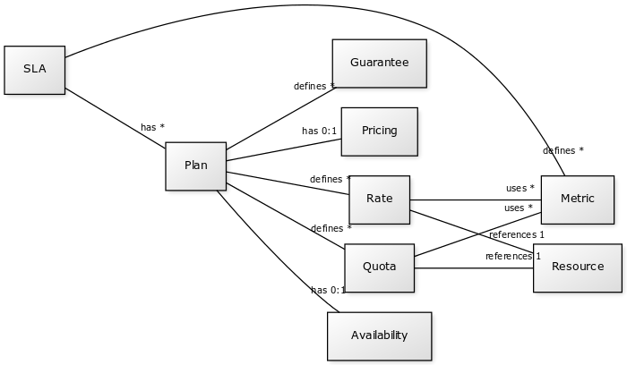

# SLA4OAI

## Minimal Specification Proposal

This proposal introduces a minimal sample to explore te syntax and semantics needed to describe SLI, SLO, SLA concepts useful to describe APIs and contracts from multiples point of views.

The main objective is to foster discussion about the essential concepts and create consensus on a minimum and as simple as possible specficiation proposal.

### 0. Meta-model

Figure 1 describes the metamodel used.




### 1. Extension Format

SLA extension can be mapped in an external YAML or JSON file. The OpenAPI specification main document can link to SLA defitions using the standard extension and `$ref` linking mechanims:

```yaml
openapi: 3.0
  ...
  x-sla:
    $ref: ./sla.yml
  ...
```

## Base Example

```yaml
sla: 1.0
context:
  id: petstore-sample
  type: plans
  api: ./petstore-service.yml
  provider: ISAGroup

infrastructure:
  supervisor: http://supervisor.sla4oai.governify.io/v1/
  monitor: http://monitor.sla4oai.governify.io/v1/

metrics:
  animalTypes:
    type: integer
    format: int64
    description: Number of different animal types.
    resolution: check
  resourceInstances:
    type: integer
    format: int64
    description: Number of pet resources
    resolution: consumption
  requests:
    type: "int64"
    description: "Number of requests"
    resolution: consumption
  responseTimeMs:
    type: "double"
    unit: "ms"
    description: "Response time in milliseconds"
    resolution: consumption
```

### 2. Header

SLA defitions (following the same guidelines applied in OpenAPI) starts with describing the document type `sla` and the version following [Semantic Versioning](https://semver.org/) conventions.

### 3. Context

Context block provide metadata to describe the type of SLA information to be provided.

- `id` provide a unique name.
- `type` can take the values `plans` or `aggrement`.
- `provider` describe the organization providing the service.

### 4. Infrastructure

Infrastructure block describes two optional endpoints to describe:

- `supervisor` URL for SLA enforcing middleware
- `monitor` URL for SLA checking middleware

### 5. Metrics

Metrics sections describes the relevant tecnical indcators and business metrics for the SLA.

There could be pure technical ones like response time, throughtput, or band-width but also business ones like sales per period, usage metrics, etc.

For each metric to be defined:

- `type` and `format` describes the data-type following same conventions as OpenAPI 3.x.
- `description` provides a label for the metric been defined.
- `resolution` could be `check` or `comsuption` (to be explained)
- `unit` (when applicable) describes the units to be used for the measure. e.g. `ms`, `req/s`, etc.


### 6. Pricing

Pricing block describes a price model fon an especific plan. Describing the `cost`, the `currency` (expresed in [ISO 4217](https://en.wikipedia.org/wiki/ISO_4217) form) and the billing period `billing`.

```yaml
pricing:
  cost: 0
  currency: EUR
  billing: monthly
availability: R/00:00:00Z/15:00:00Z
configuration:
  filteringType: none
  xmlFormat: 'false'
```

### 7. Availability

Availiability, when applicable, describes a time-windows where the API is available (using the [ISO 8601 Time Intervals](https://en.wikipedia.org/wiki/ISO_8601#Time_intervals) format).

### 8. Configuration

To be explained (Pablo)


```yaml
quotas:
  /pets:
    get:
      requests:
        - max: 10
          period: minutely
          scope: account
        - max: 40
          period: hourly
          scope: tenant
    post:
      requests:
        - max: 3
          period: minutely
      resourceInstances:
        - max: 5
      animalTypes:
        - max: 2
rates:
  /pets/{id}:
    get:
      requests:
        - max: 1
          period: secondly
```

### 9. Quotas

Quotas section describes limits to endpoints based on expression over metrics. Samples:

- maximum 10 request per minute by account to `GET /pets`
- maximum 40 request per hour by tenant to `GET /pets`
- maximum 3 request per minute by account to `POST /pets`
- maximum of 5 resource instances on `POST /pets`
- maximum of 2 animal types on `POST /pets`

### 10. Rates

Rate section describes limits to endpoints based on expression over metrics for a window time. Samples:

- maximum 1 request per second to `GET /pets/{id}`

```yaml
guarantees:
  global:
    global:
      - objective: responseTimeMs <= 800
        period: daily
        window: dynamic
```

### 11. Guarantees

Description of the API warranties commitment by the service provider.

Example:

- main objective: response time under 800 ms (measured daily).

### 12. Plans

Describes different plans including different prices and level of service. Level of service can be improved or limited depending of the plan.


```yaml
plans:
  free:
    rates:
      /pets/{id}:
        get:
          requests:
            - max: 1
              period: secondly
  pro:
    availability: R/00:00:00Z/23:59:59Z
    pricing:
      cost: 50
    configuration:
      filteringType: multipleTags
      xmlFormat: 'true'
    quotas:
      /pets:
        get:
          requests:
            - max: 20
              period: minutely
              scope: account
            - max: 100
              period: hourly
              scope: tenant
        post:
          requests:
            - max: 100
              period: minutely
          resourceInstances:
            - max: 500
          animalTypes:
            - max: 5
    guarantees:
      global:
        global:
          - objective: responseTimeMs <= 250
            period: daily
            window: dynamic
```
